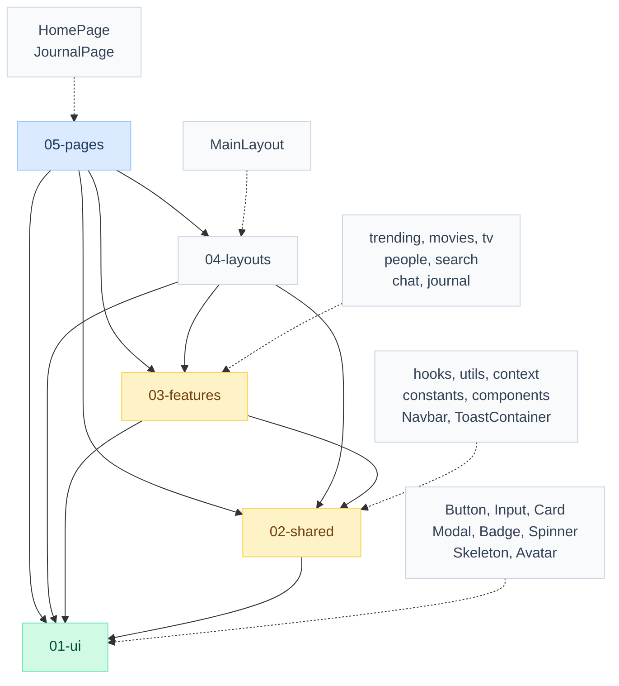
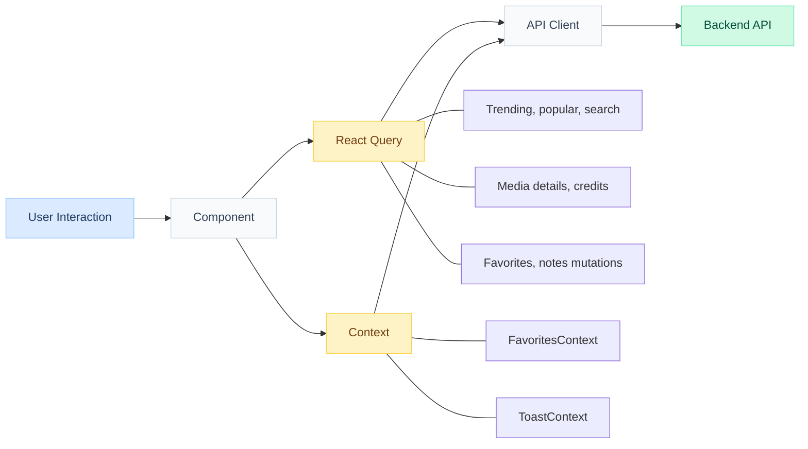

# Oskar — Movie Discovery Agent Frontend

Frontend for an AI-powered movie and TV show discovery assistant with browsing, personalized recommendations, and a personal journal.

---

## Overview

The [backend](https://github.com/kiSchlag/Oskar-Backend.git) provides Oskar, an AI agent that searches real movie data and manages a personal journal. This frontend gives users two ways to discover content: browse visually through trending, popular, and search-driven grids, or open a floating chat widget and ask Oskar directly — "What should I watch tonight?" — and receive a response with a rich media card showing poster, genres, rating, and overview.

The home page surfaces trending movies and TV shows in a hero section and horizontal carousel, followed by popular movie and TV grids and a popular people carousel. Every media card supports hover-to-preview via a floating detail panel that shows rating, overview, genres, and cast — fetched on demand without leaving the page. A search bar in the navbar provides instant multi-search results across movies, TV shows, and people in a dropdown.

The chat widget floats as a button in the bottom corner. Opening it reveals a panel where the user types a question and receives Oskar's response with markdown rendering. When Oskar recommends a specific title, a media card appears inline in the conversation with the movie's poster, metadata, and a favorite toggle. Users can ask Oskar to add or remove favorites and save notes conversationally — changes are reflected immediately in the journal.

The journal page displays all saved favorites as detailed slates with poster, genres, cast strip, rating, and an editable notes section. The entire interface uses a custom dark theme built on indigo accents, with Inter as the primary typeface.

---

## Tech Stack

| Layer | Technology |
|---|---|
| Build tool | Vite 6.0 (ESM, HMR, code splitting) |
| UI framework | React 18.3 |
| Routing | React Router 6.28 (lazy loading) |
| Styling | Tailwind CSS 4.0 (CSS-first config, custom dark theme) |
| Server state | TanStack React Query 5 (caching, mutations, optimistic updates) |
| Markdown | react-markdown |
| Positioning | Floating UI (hover cards) |
| Utilities | clsx (conditional class composition) |

---

## Key Capabilities

| Capability | Description |
|---|---|
| **Movie Discovery** | |
| Trending hero and carousel | Featured trending item as a full-width hero card, with a scrollable carousel of weekly trending content |
| Popular grids | Responsive grids for popular movies, TV shows, and a people carousel with paginated data |
| Multi-search | Navbar search bar with debounced input and a dropdown showing movies, TV shows, and people results |
| Hover cards | Floating detail panels on media cards showing rating, overview, genres, and cast — fetched on demand via Floating UI |
| **Chat Experience** | |
| Floating chat widget | Persistent chat button that opens a panel overlay for conversing with Oskar |
| Media recommendation cards | When Oskar recommends a title, a rich card renders inline with poster, genres, runtime, rating, and a favorite toggle |
| Markdown rendering | Agent responses rendered as formatted markdown via react-markdown |
| Conversation persistence | Chat sessions stored in localStorage with thread ID tracking across page reloads |
| **Personal Journal** | |
| Favorites toggle | Heart icon on every media card and recommendation card for one-click favorite management |
| Notes editor | Inline note editing on journal slates with save, update, and delete |
| Journal page | Dedicated `/journal` route displaying favorites as detailed slates with poster, cast strip, genres, rating, and notes |
| Agent-driven updates | Oskar can add favorites, remove favorites, and save notes conversationally — changes reflect instantly via React Query invalidation |
| **Performance** | |
| React Query caching | 5-minute stale time, 30-minute cache, single retry — eliminates redundant API calls |
| Lazy-loaded images | `LazyImage` component with placeholder fallbacks for all TMDB poster and backdrop images |
| Code splitting | Pages lazy-loaded via `React.lazy` + `Suspense` with a spinner fallback |
| **UI and UX** | |
| Custom dark theme | Hand-tuned color palette (dark backgrounds, indigo accents, slate text) defined as Tailwind CSS theme variables |
| Toast notifications | Slide-in notifications for errors, success confirmations, and system messages with auto-dismiss |
| Responsive layout | Mobile and desktop support with adaptive grids and carousels |
| Error boundaries | Graceful error handling that prevents full-page crashes |

---

## Architecture

### Component Layer System



### Data Flow



Imports flow strictly downward. A layer may import from any layer below it but never from a layer above. Every layer exports through barrel files (`index.js`) using named exports only. Server state (TMDB data, favorites, notes) flows through React Query; local state (favorite toggles, toast notifications) flows through React Context.

---

## Routes

| Route | Page | Layout |
|---|---|---|
| `/` | HomePage | MainLayout |
| `/journal` | JournalPage | MainLayout |

The chat widget is not a route — it renders as a floating panel accessible from any page via the `ChatWidget` component mounted in `MainLayout`.

---

## Project Structure

```text
📁 src/
├── 01-ui/                              # Stateless UI primitives
│   ├── Button.jsx                      # Primary, secondary, ghost variants with size options
│   ├── Input.jsx                       # Text input with focus ring
│   ├── Card.jsx                        # Content container with optional glow effect
│   ├── Modal.jsx                       # Dialog overlay with Escape-to-close
│   ├── Badge.jsx                       # Status indicators (default, success, warning)
│   ├── Spinner.jsx                     # Loading spinner (sm, md, lg)
│   ├── Skeleton.jsx                    # Placeholder shimmer (rectangular, circular, text)
│   ├── Avatar.jsx                      # Profile image display
│   └── index.js                        # Barrel export
│
├── 02-shared/                          # Cross-feature infrastructure
│   ├── components/                     # Navbar, SearchDropdown, LazyImage,
│   │                                   # ErrorBoundary, ToastContainer, MarkdownRenderer
│   ├── hooks/                          # useClickOutside, useDebounce, useFetch,
│   │                                   # useHoverIntent, useLocalStorage,
│   │                                   # useFavoritesQuery, useMediaDetails,
│   │                                   # useMediaCredits, useNotesQuery
│   ├── utils/                          # api (apiFetch, apiPost, apiPut, apiDelete),
│   │                                   # format (date, runtime, rating helpers)
│   ├── context/                        # FavoritesProvider + useFavorites,
│   │                                   # ToastProvider + useToast
│   ├── lib/                            # query-client config, query-keys registry
│   └── constants/                      # routes, api endpoints
│
├── 03-features/                        # Domain slices
│   ├── trending/                       # HeroSection, TrendingCarousel, trending.service, useTrending
│   ├── movies/                         # MediaCard, HoverCard, MediaCardSkeleton,
│   │                                   # PopularMoviesGrid, movies.service, usePopularMovies
│   ├── tv/                             # PopularTVGrid, tv.service, usePopularTV
│   ├── people/                         # PersonCard, PopularPeopleCarousel, people.service, usePopularPeople
│   ├── search/                         # search.service, useSearch
│   ├── chat/                           # ChatWidget, ChatFab, ChatPanel, ChatMessage,
│   │                                   # ChatMediaCard, chat.service, useChat
│   └── journal/                        # JournalSlate, FavoriteCard, NoteEditor, CastStrip,
│                                       # EmptyState, journal.service, useFavorites
│
├── 04-layouts/                         # Page shells
│   └── MainLayout.jsx                  # Navbar + content + ChatWidget + ToastContainer
│
├── 05-pages/                           # Thin orchestration pages
│   ├── home-page/HomePage.jsx          # Composes HeroSection, TrendingCarousel, PopularMoviesGrid,
│   │                                   # PopularTVGrid, PopularPeopleCarousel
│   └── journal-page/JournalPage.jsx    # Displays favorites as JournalSlates with notes
│
├── App.jsx                             # QueryClientProvider → ToastProvider → FavoritesProvider → AppRoutes
├── routes.jsx                          # React Router config with lazy loading
├── index.css                           # Tailwind imports, custom dark theme variables, animations
└── main.jsx                            # ReactDOM entry point
```

---

## How Discovery Works

### 1. Browse

The home page loads four data streams in parallel via React Query: weekly trending, popular movies, popular TV shows, and popular people. The top trending item renders as a full-width hero card with backdrop image, title, and overview. Below it, a horizontal carousel shows the rest of the trending list. Popular movies and TV shows display in responsive grids with lazy-loaded poster images. Hovering over any media card opens a floating detail panel — via Floating UI positioning — that fetches and displays the title's rating, overview, genres, and top cast on demand without navigating away.

### 2. Chat

The floating chat widget provides direct access to Oskar. The user types a question, and `useChat` sends it to `POST /chat` with the current `thread_id` (stored in localStorage). Oskar's response renders as markdown in a chat bubble. When the response includes a `media_recommendation`, a `ChatMediaCard` appears inline showing the movie's poster, title, genres, runtime or season count, rating, overview, and a favorite toggle button. The user can continue the conversation — asking follow-up questions, requesting more recommendations, or managing their journal — all within the same thread.

### 3. Collect

Every media card — in grids, carousels, hover cards, and chat recommendation cards — includes a favorite toggle powered by `FavoritesContext`. Toggling a heart icon immediately updates the UI (optimistic) and syncs with the backend via React Query mutations. The journal page at `/journal` displays all favorites as detailed slates: each slate shows the poster, title, genres, rating, cast strip (actor avatars fetched via credits API), and an editable notes section. Users can also ask Oskar to manage their journal conversationally — "add Inception to my favorites," "save a note that I loved the soundtrack" — and the frontend reflects changes instantly through query invalidation.

---

## Getting Started

### Prerequisites

- Node.js 18+
- The backend running at `http://localhost:8000` (see [backend README](../l14-t12-backend/README.md))

### Setup

```bash
# 1. Install dependencies
npm install

# 2. Start development server
npm run dev
# App: http://localhost:5173

# 3. Build for production
npm run build
npm run preview
```

---

## Configuration

| Variable | Description |
|---|---|
| `VITE_API_BASE_URL` | Backend API URL (default: `http://localhost:8000`) |

All configuration follows Vite's environment variable convention (`VITE_` prefix). The production build embeds these values at build time via `import.meta.env`. For Docker builds, pass the API URL as a build argument: `--build-arg VITE_API_BASE_URL=https://api.example.com`.

---

Released under the MIT License.
